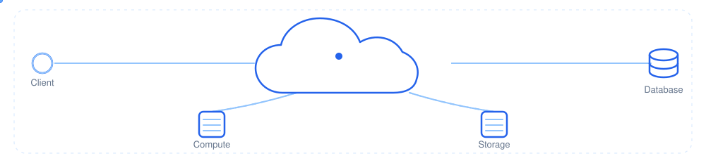

# Jeevanandan K
 
**Cloud Engineering Student • Linux • AWS • DevOps • Automation**
 
Building secure, scalable cloud infrastructure while continuously learning modern cloud technologies.
 
 

 
## About
 
B.Tech Information Technology student specializing in Cloud Engineering, with a strong focus on Linux, AWS, and Infrastructure as Code. Currently deepening my understanding of networking, automation, and containerized systems through hands-on projects rather than theory alone. Long-term goal: designing and operating secure, resilient cloud infrastructure at scale.
 
 
<table>
<tr>
<td valign="top" width="45%">
### Currently Learning
 
- Linux
- AWS
- Docker
- Networking
- Bash
- Git
- Terraform
- Kubernetes
</td>
<td valign="top" width="55%">
### Tech Stack
 

</td>
</tr>
</table>
 
## Featured Projects
 
| Project | Description | Links |
|---|---|---|
| **Portfolio Website** | Personal portfolio showcasing my background, skills, and cloud engineering journey. | [Repository](https://github.com/jeeva0128/portfolio) · [Live Demo](https://jeevanandan.me) |
| **Resume Analyzer** | Tool that parses resumes and surfaces actionable, structured improvement suggestions. | [Repository](https://github.com/jeeva0128/resume-analyzer) · [Live Demo](#) |
| **Future Cloud Projects** | Reserved space for upcoming AWS and Infrastructure-as-Code builds as I progress. | [Repository](https://github.com/jeeva0128/cloud-projects) · [Live Demo](#) |
 
 

 

  
  
  
  
  
 
   
   

  
  
  
  
  
  

 

*Always learning. Always building. Always improving.*
 

