# Jeevanandan K

**Cloud Engineering Student · Linux · AWS · DevOps · Automation**

Building secure, scalable cloud infrastructure while continuously learning modern cloud technologies.

 

 

---

### About

B.Tech Information Technology student focused on Cloud Engineering. I work with Linux, AWS, and DevOps tooling to build and automate cloud infrastructure. Currently exploring Infrastructure as Code, containerization, and networking — learning by building real projects.

---

### Currently Learning

| | | | |
|:---:|:---:|:---:|:---:|
| Linux | AWS | Docker | Networking |
| Bash | Git | Terraform | Kubernetes |

---

### Tech Stack

  
  &nbsp;
  
  &nbsp;
  
  &nbsp;
  
  &nbsp;
  
  &nbsp;
  
  &nbsp;
  
  &nbsp;
  
  &nbsp;
  

---

### Featured Projects

<table>
  <tr>
    <td align="center" width="33%">
      <h4>Portfolio Website</h4>
      
Personal portfolio showcasing cloud projects and technical writing.

      <a href="https://github.com/jeeva0128/portfolio">Repository</a> · <a href="https://jeevanandan.me">Live Demo</a>
    </td>
    <td align="center" width="33%">
      <h4>Resume Analyzer</h4>
      
Automated resume analysis tool built with Python and cloud services.

      <a href="https://github.com/jeeva0128/resume-analyzer">Repository</a> · <a href="#">Live Demo</a>
    </td>
    <td align="center" width="33%">
      <h4>Cloud Projects</h4>
      
Collection of AWS infrastructure templates and automation scripts.

      <a href="https://github.com/jeeva0128/cloud-projects">Repository</a> · <a href="#">Docs</a>
    </td>
  </tr>
</table>

---

### Connect

  
  &nbsp;
  
  &nbsp;
  
  &nbsp;
  

---

&nbsp;

&nbsp;

&nbsp;

&nbsp;

  

*Always learning. Always building. Always improving.*

